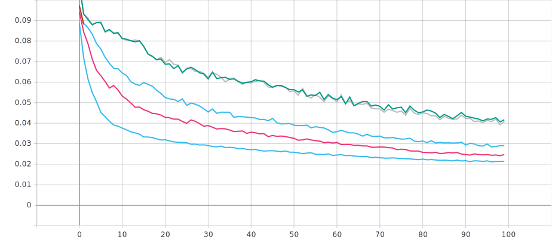
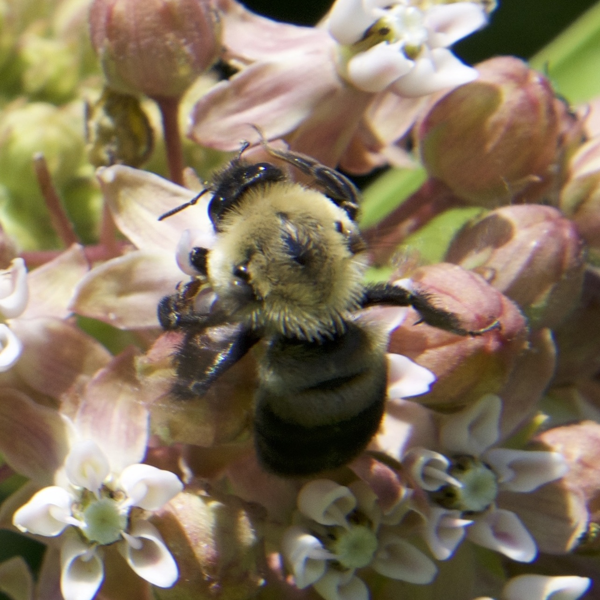

# Bee detection utility `bee-net`

## Automatic cropping

### Setup directory

Clone repository

    git clone github.com/wilberanderson/bee-net
    cd bee-net

Download the beespotter dataset: run `beescrape.py` until it all images are downloaded (roughly 15,000).

    python beescrape.py

Then remove any images that are errored or have issues. This is kind of difficult, the easiest way to get a bunch out is to sort by file size and remove any that are zero bytes. There may be a few more with issues but you should be able to catch those during training as the scripts are written to give warnings for image issues.

### Choose training method

The way I set up my training sets during this phase was by using [roboflow](app.roboflow.ai). This works well when there isn't much data, but after a certain size you have to pay for more source images.

To follow my exact steps and replicate my procedure, copy ALL of the `.txt` files in `labels_seed` into an empty directory. Then copy the images with the same names as those text files into the same directory. This is trivial and left as an exercise for the reader. Then upload the entire dataset to roboflow. My settings were:
    
    # Preprocessing options
    auto-orient: on
    resize: 416x416

    # Augmentation options
    flip: horizontal
    90 degree rotates: clockwise, ccw, upside-down
    noise: <2% of pixels

Then export the data from roboflow as yolov5 labels. After each training and analysis phase, copy the most recent `label_data_*` directory to roboflow. Then update the second cell of the jupyter notebook with the download line that roboflow generates, adding the -o flag after the `unzip` command. The line should look something like this:

    !curl -L "https://app.roboflow.ai/ds/XXXXXXXXX?key=XXXXXXXXXX" > roboflow.zip; unzip -o roboflow.zip; rm roboflow.zip

### Running the notebook

`cd` into the `bee-net` directory. Run the command `jupter notebook .`. This should open the git directory in your browser. The cropping notebook is named `Training.ipynb`. Be sure to change the directories in the file to match the hierarchy on your computer. I *highly* reccomend using and SSD to hold the images, otherwise training is going to take exponentially longer. It goes without saying that a powerful computer is needed to make training quick. In my case, it takes roughly 45 minutes start-to-finish with an R9 3900X, a 2070 Super 8GB, 32 GB of memory, and the entire training directory on a local m.2 drive.

Before you put the updated images into the training set, be sure to check through the `cropped_imgs` directory. If any pictures are not of bees, remove
 them, then re-run the cell after the heading "Copy files to new folder". This should create a new version of the label_data_* folder, which you can use for training, testing, and validation.

After enough (2-4, depending) runs of the notebook where you feed the output data back into the training set, the algorithm should kick in and take over the training. At that point, you should switch to locally hosted files for training.

Sample detection:

### Dependencies

A bunch, mostly they should be covered when installing yolo at the beginning of `Training.ipynb`.

### References

https://giou.stanford.edu/